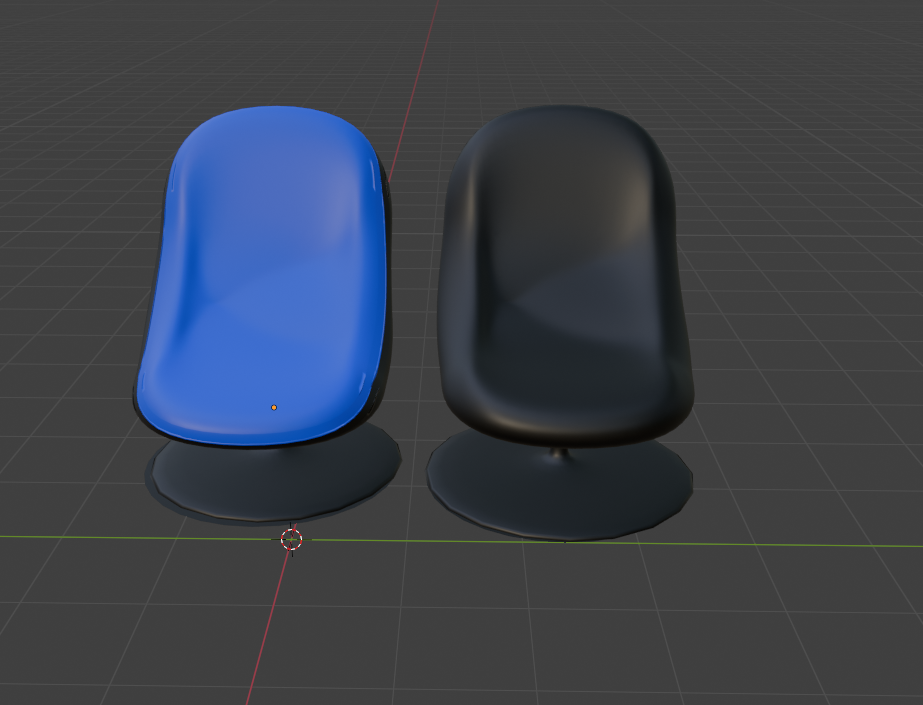

# Présentation du Projet | Project Presentation

## FR :

Ce projet consiste en la modélisation 3D de deux chaises avec Blender : l'une bleue et l'autre entièrement noire.

### Comment Utiliser

1. Clonez le dépôt sur votre machine locale.
2. Assurez-vous d'avoir Blender installé sur votre machine.
3. Ouvrez le fichier `chaises.blend` dans Blender.
4. Explorez les modèles et modifiez-les si besoin.

### Technologies Utilisées

- Blender

## ENG :

This project represents my individual effort to create 3D models of two chairs using Blender: one blue and the other entirely black. This is a project I completed with the support of my school's 3D modeling club, Model'IT, aimed at improving my skills in 3D modeling and design.

### How to Use

1. Clone the repository to your local machine.
2. Make sure you have Blender installed on your machine.
3. Open the `chaises.blend` file in Blender.
4. Explore the models and modify them as needed.

### Technologies Used

- Blender

---

## Ce que j'ai appris | What I Learned

## FR :

À travers ce projet, j'ai renforcé mes compétences en modélisation 3D avec Blender. J'ai appris à créer des objets complexes, à jouer avec les matériaux et les couleurs, et à optimiser mes designs pour différents contextes. Ce projet m'a permis d'affiner mon approche du design 3D et de mieux comprendre la gestion des textures et des rendus dans Blender.

## ENG :

Through this project, I enhanced my 3D modeling skills using Blender. I learned to create complex objects, work with materials and colors, and optimize my designs for various contexts. This project helped refine my approach to 3D design and deepened my understanding of texture management and rendering in Blender.

---

## Auteur | Author

- [Nassim EL HADDAD](https://www.linkedin.com/in/nassim-el-haddad-4aa298271/)

---

### Liens Utiles | Useful Links

- [Blender](https://www.blender.org/)

---

### Image

